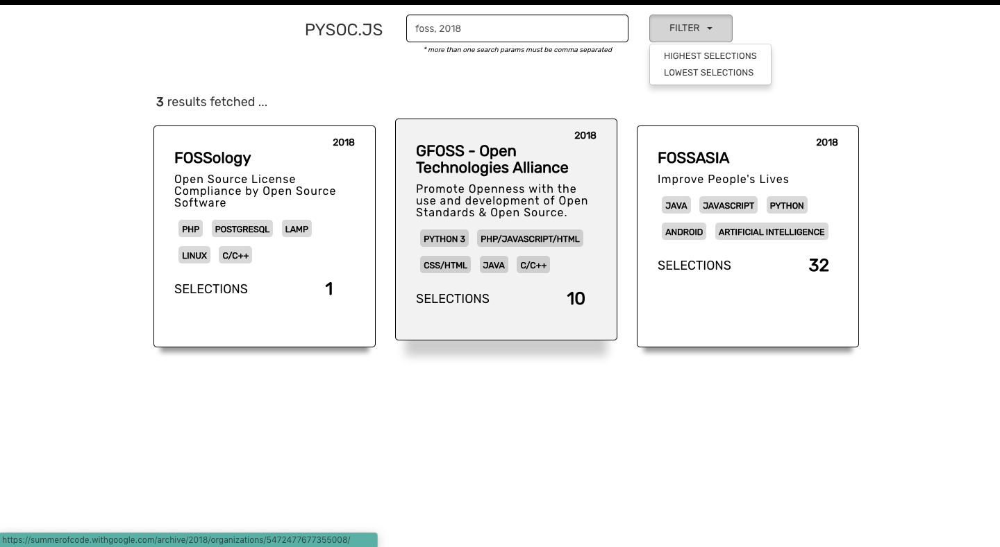
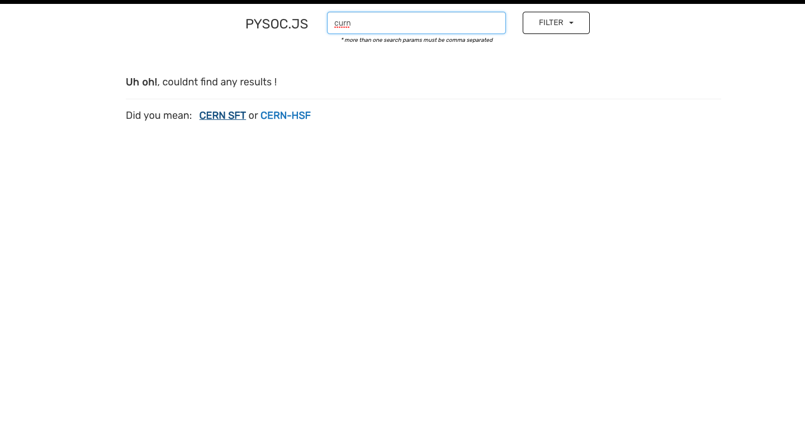

Simple gsoc data scraper, search for any keyword and get data about the orgs that match your search criteria

Try it out here: [https://pysocjs.herokuapp.com/](https://pysocjs.herokuapp.com/)

#

#### Use `FILTERS` to Sort and Analyse the Data, lets you sort data based on the `number of selections`.
#### Perform Complex Search Queries, by adding multiple search parameters.

#

#### Added Fuzzy Logic to search, incase search parameters don't match! Suggests the best matching organisation.

#

#### Also view in which years has the organisation been selected in the past 3 years, with it's total selection in the past years. -> `ORG SELECTION` option.

